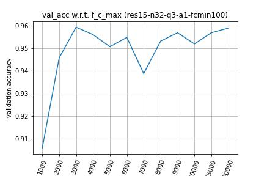

# KeywordSpotting
This is a repository for the project of course E6692

|n_filter|q  |a_pb|f_c_min|f_c_max|Model  |Acc(%)|
|---     |---|--- |---    |---    |---    |---   |
| 32     |3  |1   | 100   |1000   |res15  |90.58 |
| 32     |3  |1   | 100   |2000   |res15  |94.57 |
| 32     |3  |1   | 100   |3000   |res15  |95.92 |
| 32     |3  |1   | 100   |4000   |res15  |95.60 |
| 32     |3  |1   | 100   |5000   |res15  |95.06 |
| 32     |3  |1   | 100   |6000   |res15  |95.47 |
| 32     |3  |1   | 100   |7000   |res15  |93.87 |
| 32     |3  |1   | 100   |8000   |res15  |95.31 |
| 32     |3  |1   | 100   |9000   |res15  |95.68 |
| 32     |3  |1   | 100   |10000  |res15  |95.18 |
| 32     |3  |1   | 100   |15000  |res15  |95.68 |
| 32     |3  |1   | 100   |20000  |res15  |95.88 |

