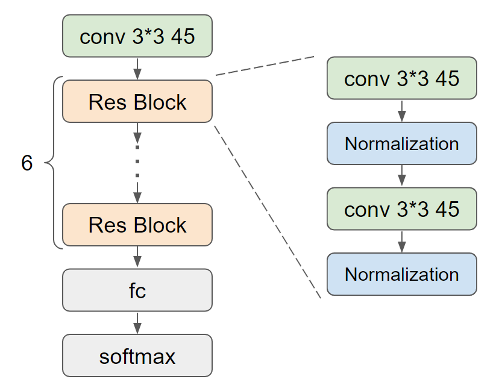

# KeywordSpotting
This is a repository for the project of course E6692


## Environment
- Install Python dependencies: `pip install -r requirements.txt`


## Dataset
The dataset used in this project is [Google Speech Commands v1](https://www.tensorflow.org/datasets/catalog/speech_commands).

Fetch the dataset run: `./data/download_dataset.sh`

To use the feature extracted from MATLAB function, contact me for the data.

Then convert the format of data by: `python utils/conver_mat_np.py`

## Model
The model used in this project is res15 refered from [Deep Residual Learning for Small-Footprint Keyword Spotting](https://arxiv.org/abs/1710.10361), [Reference repo](https://github.com/castorini/honk).

Model structure: 

<!--  -->


## Usage

The training process of model can be found in:
- `model_train.ipynb`

To traverse a parameter, look into the `train_model.py`

Run: `pyhon train_model.py`

## Logs

The full log was recorded in `./logs`

## Structure of this repo:

```
.
├── README.md
├── README_original.md
├── load_audio.ipynb
├── matlab_functions.ipynb
├── model_train.ipynb
├── requirements.txt
├── show_result.ipynb
├── train_model.py
├── utils
│   │   ├── audio_process.cpython-37.pyc
│   │   ├── dataset.cpython-37.pyc
│   │   ├── logger.cpython-37.pyc
│   │   ├── model.cpython-37.pyc
│   │   ├── train.cpython-37.pyc
│   │   └── utils.cpython-37.pyc
│   ├── audio_process.py
│   ├── convert_mat_np.py
│   ├── dataset.py
│   ├── logger.py
│    ├── model.py
│   ├── train.py
│    └── utils.py
├── data
│   └── download_dataset.sh
├── pics
│   ├── n32-q3-a1-100-4000_res15_adam_acc.jpg
│   ├── n32-q3-a1-100-4000_res15_adam_loss.jpg
│   ├── res15.jpg
│   ├── res15_model_structure.png
│   └── res8.jpg
├── check_points
│   └── res
│       ├── best_model_res15.pt
│       ├── best_model_res8.pt
│       ├── n32-q3-a1-100-4000_res15.pt
│       ├── res15.jpg
│       └── res8.jpg
└── logs
    ├── 2022-04-30
    │   ├── res15-n32-q3-a1-100-1000
    │   │   ├── res15-n32-q3-a1-100-1000.pt
    │   │   ├── res15-n32-q3-a1-100-1000_log.txt
    │   │   ├── res15_acc.jpg
    │   │   ├── res15_loss.jpg
    │   │   ├── train_acc_hist.npy
    │   │   ├── train_loss_hist.npy
    │   │   ├── val_acc_hist.npy
    │   │   └── val_loss_hist.npy
    │   ├── res15-n32-q3-a1-100-10000
    │   ├── res15-n32-q3-a1-100-15000
    │   ├── res15-n32-q3-a1-100-2000
    │   ├── res15-n32-q3-a1-100-20000
    │   ├── res15-n32-q3-a1-100-3000
    │   ├── res15-n32-q3-a1-100-4000
    │   ├── res15-n32-q3-a1-100-5000
    │   ├── res15-n32-q3-a1-100-6000
    │   ├── res15-n32-q3-a1-100-7000
    │   ├── res15-n32-q3-a1-100-8000
    │   ├── res15-n32-q3-a1-100-9000
    │   └── result.jpg
    ├── 2022-05-04
    │   ├── res15-n1-q3-a1-100-4000
    │   ├── res15-n12-q3-a1-100-4000
    │   ├── res15-n16-q3-a1-100-4000
    │   ├── res15-n20-q3-a1-100-4000
    │   ├── res15-n24-q3-a1-100-4000
    │   ├── res15-n28-q3-a1-100-4000
    │   ├── res15-n32-q3-a1-100-4000
    │   ├── res15-n36-q3-a1-100-4000
    │   ├── res15-n4-q3-a1-100-4000
    │   ├── res15-n40-q3-a1-100-4000
    │   ├── res15-n44-q3-a1-100-4000
    │   ├── res15-n48-q3-a1-100-4000
    │   ├── res15-n52-q3-a1-100-4000
    │   ├── res15-n56-q3-a1-100-4000
    │   ├── res15-n60-q3-a1-100-4000
    │   ├── res15-n64-q3-a1-100-4000
    │   ├── res15-n8-q3-a1-100-4000
    │   └── result.jpg
    ├── 2022-05-05
    │   ├── res15-n32-q3-a1-100-1000
    │   ├── res15-n32-q3-a1-100-10000
    │   ├── res15-n32-q3-a1-100-15000
    ├── res15-n32-q3-a1-100-2000
    │   ├── res15-n32-q3-a1-100-20000
    │   ├── res15-n32-q3-a1-100-3000
    │   ├── res15-n32-q3-a1-100-4000
    │   ├── res15-n32-q3-a1-100-5000
    │   ├── res15-n32-q3-a1-100-6000
    │   ├── res15-n32-q3-a1-100-7000
    │   ├── res15-n32-q3-a1-100-8000
    │   ├── res15-n32-q3-a1-100-9000
    │   └── result.jpg
    ├── 2022-05-06
    │   ├── res15-n32-q0.2-a1-100-4000
    │   ├── res15-n32-q0.4-a1-100-4000
    │   ├── res15-n32-q0.6-a1-100-4000
    │   ├── res15-n32-q0.8-a1-100-4000
    │   └── res15-n32-q1-a1-100-4000
    └── 2022-05-07
        ├── res15-n32-q1.5-a1-100-4000
        ├── res15-n32-q10-a1-100-4000
        ├── res15-n32-q15-a1-100-4000
        ├── res15-n32-q2-a1-100-4000
        ├── res15-n32-q2.5-a1-100-4000
        ├── res15-n32-q20-a1-100-4000
        ├── res15-n32-q3-a1-100-4000
        ├── res15-n32-q3.5-a1-100-4000
        ├── res15-n32-q30-a1-100-4000
        ├── res15-n32-q4-a1-100-4000
        ├── res15-n32-q4.5-a1-100-4000
        ├── res15-n32-q5-a1-100-4000
        ├── res15-n32-q6-a1-100-4000
        ├── res15-n32-q7-a1-100-4000
        ├── res15-n32-q8-a1-100-4000
        ├── res15-n32-q9-a1-100-4000
        └── result.jpg

74 directories, 532 files
```