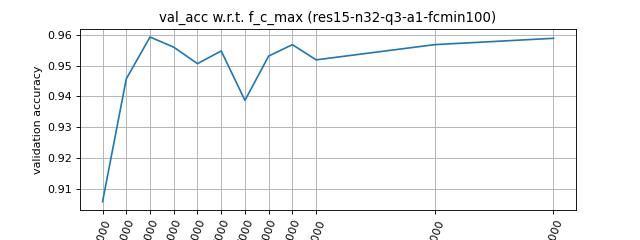

# KeywordSpotting
This is a repository for the project of course E6692

|n_filter|q  |a_pb|f_c_min|f_c_max|Model  |Acc(%)|
|---     |---|--- |---    |---    |---    |---   |
| 32     |3  |1   | 100   |1000   |res15  |90.58 |
| 32     |3  |1   | 100   |2000   |res15  |94.57 |
| 32     |3  |1   | 100   |3000   |res15  |95.92 |
| 32     |3  |1   | 100   |4000   |res15  |95.60 |
| 32     |3  |1   | 100   |5000   |res15  |95.06 |
| 32     |3  |1   | 100   |6000   |res15  |95.47 |
| 32     |3  |1   | 100   |7000   |res15  |93.87 |
| 32     |3  |1   | 100   |8000   |res15  |95.31 |
| 32     |3  |1   | 100   |9000   |res15  |95.68 |
| 32     |3  |1   | 100   |10000  |res15  |95.18 |
| 32     |3  |1   | 100   |15000  |res15  |95.68 |
| 32     |3  |1   | 100   |20000  |res15  |95.88 |

|n_filter|q  |a_pb|f_c_min|f_c_max|Model  |Acc(%)|
|---     |---|--- |---    |---    |---    |---   |
| 1      |3  |1   | 100   |4000   |res15  |72.82 |
| 4      |3  |1   | 100   |4000   |res15  |93.13 |
| 8      |3  |1   | 100   |4000   |res15  |94.16 |
| 12     |3  |1   | 100   |4000   |res15  |96.75 |
| 16     |3  |1   | 100   |4000   |res15  |96.01 |
| 20     |3  |1   | 100   |4000   |res15  |96.13 |
| 24     |3  |1   | 100   |4000   |res15  |96.98 |
| 28     |3  |1   | 100   |4000   |res15  |95.76 |
| 32     |3  |1   | 100   |4000   |res15  |95.80 |
| 36     |3  |1   | 100   |4000   |res15  |95.88 |
| 40     |3  |1   | 100   |4000   |res15  |94.77 |
| 44     |3  |1   | 100   |4000   |res15  |95.68 |
| 48     |3  |1   | 100   |4000   |res15  |96.62 |
| 52     |3  |1   | 100   |4000   |res15  |95.97 |
| 56     |3  |1   | 100   |4000   |res15  |96.13 |
| 60     |3  |1   | 100   |4000   |res15  |96.01 |
| 64     |3  |1   | 100   |4000   |res15  |95.35 |

